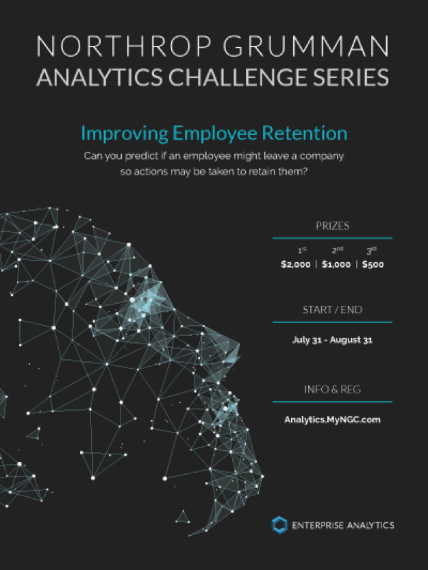
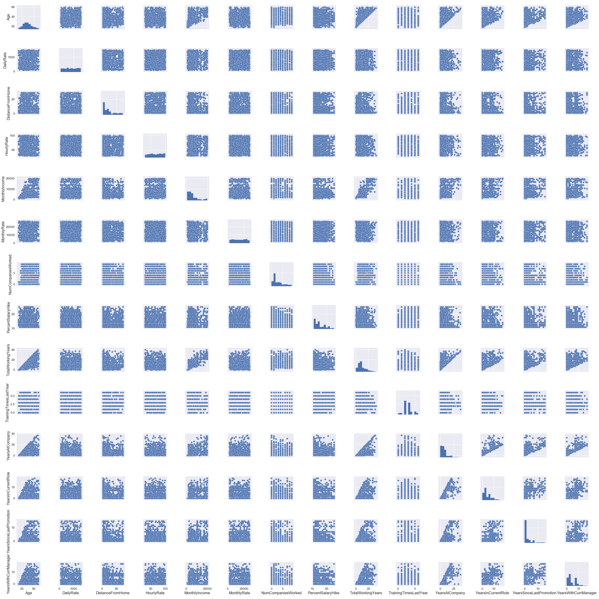
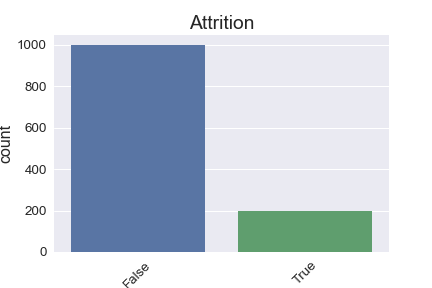
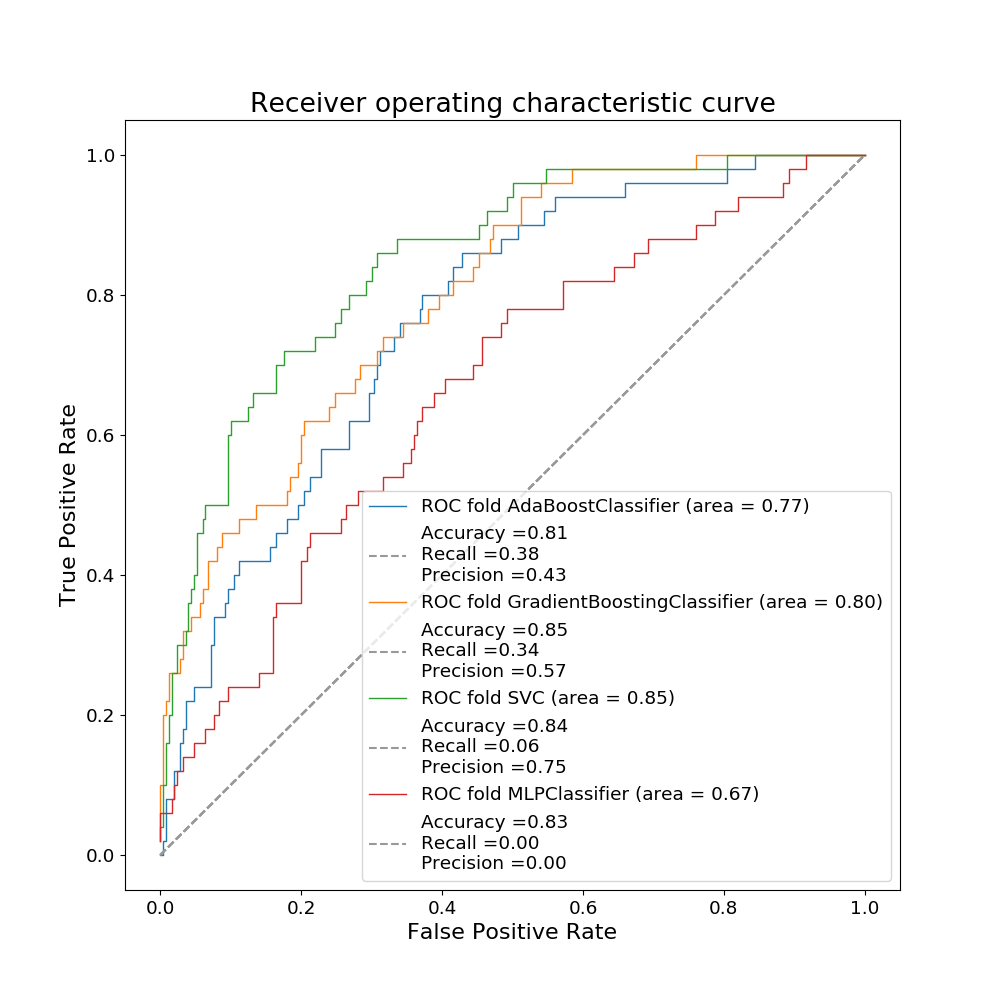
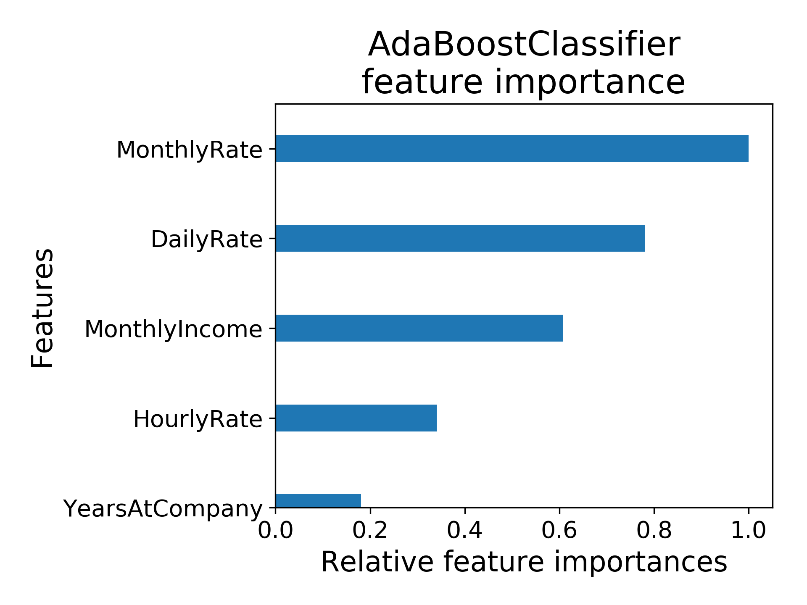
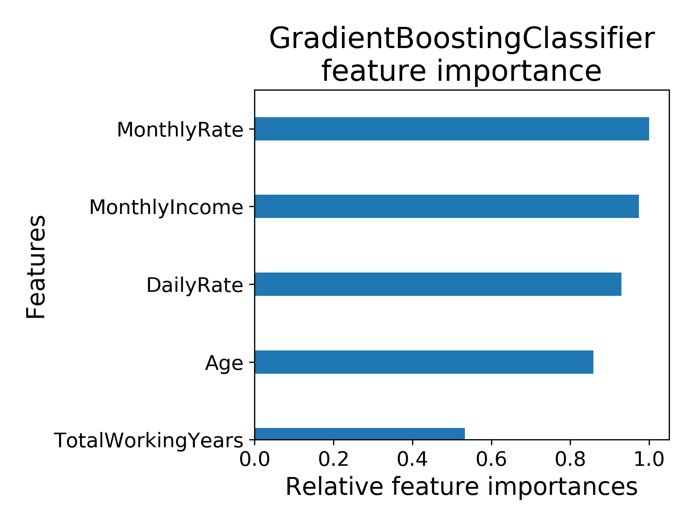

# To leave or not to leave?

The analytics challenge was to predict attrition based on a given training dataset. The dataset to be used was 1,200 rows and 35 columns of completely fictitious employee data that was obtained, with permission, from an external source. The dataset was created using simulation software to identify interesting fields that may be used to predict attrition. I participated by teaming up with my mother who is an employee at Northrop Grumman.



### Exploratory Data Analysis
First order of business is always exploratory data analysis. I began by looking at feature data types and I found several non-numerics which would need to be transformed before models could be applied. The statistical summary and correlation matrix give an overview of numerical features. With respect to Attrition, the top 3 correlated features goes to Age, TotalWorkingYears, and YearsInCurrentRole. These are negative which can be interpreted that an employee is less likely to leave as these features increase. However, the correlation values are also very low (<.3) which does not present a strong correlation between any individual feature and the target. The top 5 strongest correlations are between features: JobLevel/MonthlyIncome, JobLevel/TotalWorkingYears, MonthlyIncome/TotalWorkingYears, YearsAtCompany/YearsWithCurrManager, PerformanceRating/PercentSalaryHike. These combinations make intuitive sense when it comes to work culture. One would expect that these would increase with respect to one another.

|                          | Age     | Attrition | DailyRate | DistanceFromHome | Education | EnvironmentSatisfaction | HourlyRate | JobInvolvement | JobLevel | JobSatisfaction | MonthlyIncome | MonthlyRate | NumCompaniesWorked | PercentSalaryHike | PerformanceRating | RelationshipSatisfaction | StockOptionLevel | TotalWorkingYears | TrainingTimesLastYear | WorkLifeBalance | YearsAtCompany | YearsInCurrentRole | YearsSinceLastPromotion | YearsWithCurrManager |
|--------------------------|---------|-----------|-----------|------------------|-----------|-------------------------|------------|----------------|----------|-----------------|---------------|-------------|--------------------|-------------------|-------------------|--------------------------|------------------|-------------------|-----------------------|-----------------|----------------|--------------------|-------------------------|----------------------|
| Age                      | 1.0     | -0.1893   | 0.0126    | 0.0011           | 0.2224    | 0.0143                  | 0.004      | 0.0499         | 0.5267   | -0.015          | 0.5134        | 0.0196      | 0.2955             | 0.0046            | 0.0109            | 0.0524                   | 0.0477           | 0.6918            | -0.0138               | -0.0325         | 0.3349         | 0.2368             | 0.2293                  | 0.229                |
| Attrition                | -0.1893 | 1.0       | -0.0613   | 0.0813           | -0.0235   | -0.1197                 | -0.0158    | -0.1266        | -0.1593  | -0.1049         | -0.1532       | 0.0363      | 0.0332             | -0.0157           | 0.0127            | -0.0617                  | -0.1576          | -0.1786           | -0.0539               | -0.0578         | -0.1511        | -0.174             | -0.0496                 | -0.166               |
| DailyRate                | 0.0126  | -0.0613   | 1.0       | 0.0058           | -0.0223   | 0.0035                  | 0.0486     | 0.0578         | 0.0243   | 0.0172          | 0.0262        | -0.0414     | 0.0368             | 0.0113            | -0.0081           | -0.0025                  | 0.045            | 0.0235            | 0.0199                | -0.0386         | -0.0279        | 0.0187             | -0.0149                 | -0.021               |
| DistanceFromHome         | 0.0011  | 0.0813    | 0.0058    | 1.0              | 0.0344    | -0.0121                 | 0.007      | -0.0069        | -0.0094  | -0.0058         | -0.0353       | 0.0251      | -0.03              | 0.0321            | 0.0185            | -0.0049                  | 0.0404           | -0.0129           | -0.0353               | -0.0461         | -0.0129        | 0.0003             | 0.0122                  | 0.0001               |
| Education                | 0.2224  | -0.0235   | -0.0223   | 0.0344           | 1.0       | -0.028                  | 0.0167     | 0.0473         | 0.1125   | 0.0023          | 0.1085        | -0.0452     | 0.1237             | -0.007            | -0.0197           | -0.0091                  | 0.0283           | 0.156             | -0.0445               | 0.0142          | 0.0779         | 0.0803             | 0.0749                  | 0.0905               |
| EnvironmentSatisfaction  | 0.0143  | -0.1197   | 0.0035    | -0.0121          | -0.028    | 1.0                     | -0.0447    | 0.0166         | -0.0069  | -0.004          | -0.0199       | 0.0382      | 0.0155             | -0.0393           | -0.0394           | 0.0327                   | 0.01             | -0.0056           | -0.0286               | 0.0428          | -0.0098        | 0.0134             | 0.0123                  | -0.0182              |
| HourlyRate               | 0.004   | -0.0158   | 0.0486    | 0.007            | 0.0167    | -0.0447                 | 1.0        | 0.0425         | -0.0389  | -0.077          | -0.0257       | -0.0183     | 0.0356             | -0.0167           | -0.0183           | 0.0218                   | 0.0728           | -0.0312           | 0.0034                | 0.0063          | -0.0342        | -0.0399            | -0.0306                 | -0.0346              |
| JobInvolvement           | 0.0499  | -0.1266   | 0.0578    | -0.0069          | 0.0473    | 0.0166                  | 0.0425     | 1.0            | -0.0124  | -0.0337         | -0.0195       | -0.0254     | 0.0234             | -0.0121           | -0.0234           | 0.0233                   | 0.0469           | -0.0065           | -0.0111               | 0.0036          | -0.0321        | 0.0149             | -0.0216                 | 0.0202               |
| JobLevel                 | 0.5267  | -0.1593   | 0.0243    | -0.0094          | 0.1125    | -0.0069                 | -0.0389    | -0.0124        | 1.0      | -0.0168         | 0.949         | 0.043       | 0.1503             | -0.0381           | -0.0116           | 0.0393                   | 0.0116           | 0.791             | -0.0254               | 0.0362          | 0.5364         | 0.3864             | 0.3662                  | 0.3797               |
| JobSatisfaction          | -0.015  | -0.1049   | 0.0172    | -0.0058          | 0.0023    | -0.004                  | -0.077     | -0.0337        | -0.0168  | 1.0             | -0.0255       | 0.0148      | -0.0571            | 0.0195            | -0.002            | -0.0206                  | 0.0065           | -0.0372           | -0.0047               | -0.0272         | -0.0036        | -0.004             | -0.0255                 | -0.0269              |
| MonthlyIncome            | 0.5134  | -0.1532   | 0.0262    | -0.0353          | 0.1085    | -0.0199                 | -0.0257    | -0.0195        | 0.949    | -0.0255         | 1.0           | 0.0416      | 0.1591             | -0.0373           | -0.0152           | 0.044                    | 0.0096           | 0.7763            | -0.0251               | 0.0289          | 0.5104         | 0.3553             | 0.3568                  | 0.3464               |
| MonthlyRate              | 0.0196  | 0.0363    | -0.0414   | 0.0251           | -0.0452   | 0.0382                  | -0.0183    | -0.0254        | 0.043    | 0.0148          | 0.0416        | 1.0         | 0.0204             | 0.0022            | 0.0166            | 0.0166                   | -0.0567          | 0.02              | 0.0109                | 0.0147          | -0.0145        | -0.023             | 0.0055                  | -0.0364              |
| NumCompaniesWorked       | 0.2955  | 0.0332    | 0.0368    | -0.03            | 0.1237    | 0.0155                  | 0.0356     | 0.0234         | 0.1503   | -0.0571         | 0.1591        | 0.0204      | 1.0                | -0.0298           | -0.0193           | 0.0559                   | 0.0369           | 0.2412            | -0.059                | -0.0281         | -0.1133        | -0.0732            | -0.0292                 | -0.1027              |
| PercentSalaryHike        | 0.0046  | -0.0157   | 0.0113    | 0.0321           | -0.007    | -0.0393                 | -0.0167    | -0.0121        | -0.0381  | 0.0195          | -0.0373       | 0.0022      | -0.0298            | 1.0               | 0.7615            | -0.0389                  | 0.0243           | -0.0292           | -0.0214               | -0.015          | -0.0477        | -0.0068            | -0.0137                 | -0.0225              |
| PerformanceRating        | 0.0109  | 0.0127    | -0.0081   | 0.0185           | -0.0197   | -0.0394                 | -0.0183    | -0.0234        | -0.0116  | -0.002          | -0.0152       | 0.0166      | -0.0193            | 0.7615            | 1.0               | -0.0364                  | 0.0148           | 0.0134            | -0.0262               | -0.0134         | 0.008          | 0.0388             | 0.0299                  | 0.0258               |
| RelationshipSatisfaction | 0.0524  | -0.0617   | -0.0025   | -0.0049          | -0.0091   | 0.0327                  | 0.0218     | 0.0233         | 0.0393   | -0.0206         | 0.044         | 0.0166      | 0.0559             | -0.0389           | -0.0364           | 1.0                      | -0.0404          | 0.0376            | 0.0087                | 0.0137          | 0.0316         | -0.0016            | 0.059                   | 0.0177               |
| StockOptionLevel         | 0.0477  | -0.1576   | 0.045     | 0.0404           | 0.0283    | 0.01                    | 0.0728     | 0.0469         | 0.0116   | 0.0065          | 0.0096        | -0.0567     | 0.0369             | 0.0243            | 0.0148            | -0.0404                  | 1.0              | 0.0155            | 0.0231                | 0.0087          | 0.0192         | 0.0623             | 0.0202                  | 0.0196               |
| TotalWorkingYears        | 0.6918  | -0.1786   | 0.0235    | -0.0129          | 0.156     | -0.0056                 | -0.0312    | -0.0065        | 0.791    | -0.0372         | 0.7763        | 0.02        | 0.2412             | -0.0292           | 0.0134            | 0.0376                   | 0.0155           | 1.0               | -0.0466               | 0.0007          | 0.6424         | 0.4758             | 0.4244                  | 0.4757               |
| TrainingTimesLastYear    | -0.0138 | -0.0539   | 0.0199    | -0.0353          | -0.0445   | -0.0286                 | 0.0034     | -0.0111        | -0.0254  | -0.0047         | -0.0251       | 0.0109      | -0.059             | -0.0214           | -0.0262           | 0.0087                   | 0.0231           | -0.0466           | 1.0                   | 0.0402          | -0.0021        | 0.0071             | -0.0104                 | -0.0108              |
| WorkLifeBalance          | -0.0325 | -0.0578   | -0.0386   | -0.0461          | 0.0142    | 0.0428                  | 0.0063     | 0.0036         | 0.0362   | -0.0272         | 0.0289        | 0.0147      | -0.0281            | -0.015            | -0.0134           | 0.0137                   | 0.0087           | 0.0007            | 0.0402                | 1.0             | 0.0134         | 0.0479             | 0.001                   | -0.005               |
| YearsAtCompany           | 0.3349  | -0.1511   | -0.0279   | -0.0129          | 0.0779    | -0.0098                 | -0.0342    | -0.0321        | 0.5364   | -0.0036         | 0.5104        | -0.0145     | -0.1133            | -0.0477           | 0.008             | 0.0316                   | 0.0192           | 0.6424            | -0.0021               | 0.0134          | 1.0            | 0.7588             | 0.6237                  | 0.7751               |
| YearsInCurrentRole       | 0.2368  | -0.174    | 0.0187    | 0.0003           | 0.0803    | 0.0134                  | -0.0399    | 0.0149         | 0.3864   | -0.004          | 0.3553        | -0.023      | -0.0732            | -0.0068           | 0.0388            | -0.0016                  | 0.0623           | 0.4758            | 0.0071                | 0.0479          | 0.7588         | 1.0                | 0.5465                  | 0.7119               |
| YearsSinceLastPromotion  | 0.2293  | -0.0496   | -0.0149   | 0.0122           | 0.0749    | 0.0123                  | -0.0306    | -0.0216        | 0.3662   | -0.0255         | 0.3568        | 0.0055      | -0.0292            | -0.0137           | 0.0299            | 0.059                    | 0.0202           | 0.4244            | -0.0104               | 0.001           | 0.6237         | 0.5465             | 1.0                     | 0.5231               |
| YearsWithCurrManager     | 0.229   | -0.166    | -0.021    | 0.0001           | 0.0905    | -0.0182                 | -0.0346    | 0.0202         | 0.3797   | -0.0269         | 0.3464        | -0.0364     | -0.1027            | -0.0225           | 0.0258            | 0.0177                   | 0.0196           | 0.4757            | -0.0108               | -0.005          | 0.7751         | 0.7119             | 0.5231                  | 1.0                  |

### Data Visualization
Plotting also helps to visualize and understand the relationship between features. The scatter plots below are a visual representation of correlation identified by a general increasing or decreasing trend between the variables. The positive correlation is most obvious for the combinations of features listed above by looking at their scatter plot. Collinearity reduces accuracy for regression models and influences feature importance. One way to deal with this is to eliminate redundant features from the analysis. Although this can be risky because we do not always understand the complicated relationships between features. Without a pending timeline to submit, I left all features included in the dataset. I would like to explore regularization at a future time to improve the result.



To see the data distribution, I created histograms and violin plots to see which features were normalized and which were skewed or imbalanced. Right away I noticed that the target, Attrition, was an imbalanced class with only 17% positive. In these cases, the relative class frequency can be preserved by stratifying the internal test/train data split to ensure each set contains approximately the same percentage of samples of each target class as the complete set.



### Data Preprocessing
Next, I went about preprocessing the data. Categorical features were converted to numerical dummies where presence of a level is represented by 1 and absence is represented by 0. Several features were dropped that did not add value to the model (StandardHours, Over18, EmployeeCount, and EmployeeNumber). The target (Attrition) was converted to the integer 1 for positive cases and 0 for negative cases.

    ```python
      def load_and_clean_data(filename):
          df = pd.read_csv(filename)
          del df['StandardHours']     # every value is 80
          del df['Over18']            # every value is 'Y'
          del df['EmployeeCount']     # every value is 1
          del df ['EmployeeNumber']   # unique for every employee
          travel = ['Non-Travel', 'Travel_Rarely', 'Travel_Frequently']
          df['BusinessTravel'] = df.BusinessTravel.astype("category", ordered=True, categories=travel).cat.codes
          df = pd.get_dummies(df, columns=['Department', 'EducationField', 'Gender', 'JobRole', 'MaritalStatus', 'OverTime'], drop_first=True, prefix=['Dept', 'Edu', 'Gender', 'Role', 'Status', 'OT'])
          return df
      df['Attrition'] = (df['Attrition'] == 'Yes').astype(int)
    ```

The training data was then split into an internal training (75%) and testing (25%) set for model evaluation. I also standardized features by removing the mean and scaling to unit variance using the StandardScaler class object. The transformation was also applied to the final test data before making predictions.

### Model Analysis
I chose to target recall score (proportion of positive cases labeled correctly) because the employer would rather identify a false positive that a false negative; In this scenario, the employer would rather have the opportunity to work with an employee that is not likely to leave than to miss an opportunity to intervene with an employee that is considering leaving.

With only three days notice before the challenge ended, I focused my efforts on the tools that I believed to have the most predictive power—-boosting models. Boosting models are trained in sequence to adjust the weights for data points that were classified incorrectly on the previous model. Decision Trees were used as the base estimator for the AdaBoostClassifier and GradientBoostingClassifier models. Using GridSearchCV to optimize parameters, I was able to tune the learning rate and number of estimators used for the boosting models. I also limited the maximum number of features and depth of tree for the GradientBoostingClassifier. These initial models were able to produce recall rates between 36 and 38 percent. One submission was allotted per day with the following results: GradientBoostingClassifier score 63% and AdaBoostClassifier score 57%.

In my last attempt, I added Support Vector and Multi-Layer Perceptron Neural Network models as alternatives. Again, I used GridSearchCV to narrow down my initial parameter choices. Unfortunately, I was not able to improve the recall score that I had achieved with the boosting models. The ROC (Receiver Operating Characteristic) curve plot below provides a summary comparison of the models that were used. This curve is a nice way to find the tradeoff between true positive rate and false positive rate at various classification thresholds. The ideal model should have the maximum AUC (area under the curve) as well as the highest recall score.



### Feature Importance
The relative feature importance for the boosting models identified the following features as being the most significant. The top 3 features for both boosting models were financially related: MonthlyRate, DailyRate and MonthlyIncome. It's likely that some level of multicollinearity exists between these features and that only one is necessary for a predictive model. Age appeared to be the next most important feature.





### Final Thoughts
I did not come close to winning first place but I relished the opportunity to apply my young coding and machine learning skills. Given the relatively short amount of time I had to submit predictions, this model still has plenty of room for improvement. Another path worth exploring is feature reduction. There were 30 features used to train the models which causes concern for the curse of dimensionality. As more features and dimensions are used, the trained model becomes more complex and is more likely to be overfitted to the training data and less likely to do well with testing data. Regularization and feature reduction tools could be used in the pipeline to further improve the models. I could also spend more time tuning the parameters of the models or introduce new models such as a basic Logistic Regression or a Random Forest Classifier.

I found the topic of employee retention to be relevant for all employers who are interested in retaining internal talent and desire to intervene based on predictive signs. Let's hope that this study inspires more businesses to do the same and invest in their own people!
